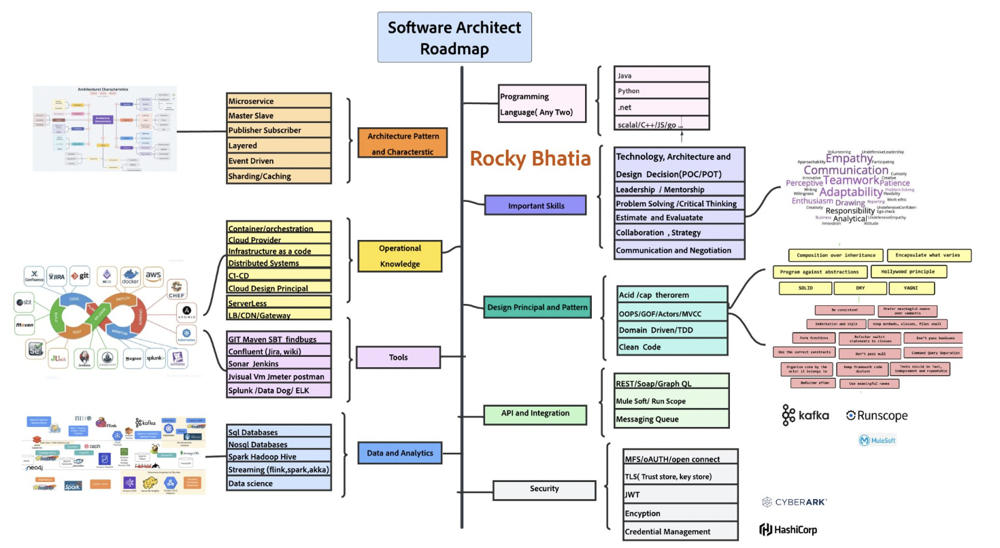

## analytics_solution_architecture
#### Reference : https://www.linkedin.com/in/rocky-bhatia-a4801010/
    How to Become a Software Architect
    
    Being a good architect is achieved by applying and implementing more than reading.
    
    After getting 100's DM on the guidance of becoming a software architect, Based on my working experience, I have created the below roadmap.
    
    The position of a software architect requires a profound knowledge of software functionality, performance, viability, scalability, comprehensibility, security, and technological constraints.
    
    
    Language :
    
    To start your career as a Software Architect, you should have a sound knowledge of programming languages & frameworks.
    Architects lead the team of developers, collaborate with other groups, review code, etc. hence one must have a thorough understanding of programming concepts and paradigms.
    
    Architecture Pattern and Style :
    
    In software engineering, a design pattern is a general, reusable solution for solving a common problem when designing an application or system.
    
    Microservice
    Event Driven
    Layered 
    Master-Slave
    Publisher Subscriber  
    
    Design Principal and Pattern 
    
    A design pattern is more of a template to approach the problem.
    
    Design Pattern - GOF , OOPS principle, programming Paradigms. 
    ACID (Atomicity, Consistency, Isolation, Durability) 
    CAP (Consistency, Availability, Partition Tolerance) 
    SOLID  
    Domain-driven design 
    
    Important Skills :
    An architect takes all Technology, Architecture, and Design Decisions and conducts the POT and POC.
    He mentors technical teams and promotes quality standards and the right vision of the product. As a result, they should be able to win authority and respect.
    An architect communicates with stakeholders, business analysts, and engineers, explaining the benefits of employing certain technologies or applying a specific pattern. He manages the system design and should be able to identify risks timely. 
    
    Operational Knowledge - one should have working experience in some of the following areas to make a better decision. 
    
    Containers 
    IAAS .
    Serverless 
    CI/CD .
    Cloud design 
    Distributed computing 
    LB 
    Security Gateway 
    
    Data and Analytics:  One should have strong hands with the some of the following tools 
    
    SQL and NoSQL databases 
    Batch processing ( Spark ,Hadoop)
    Stream Processing ( flink, spark streaming ,storm)
    Warehouse (hive, snowflake )
    
    Tools - Hands on experience with Important tools like 
    git, maven,check style,find bugs, 
    Jira, sonar, jenkins, 
    JMeter ,splunk etc 
    
    API and Integration - Rest/Soap/graphql and api management like mule soft, messaging queues . 
    
    Security - Security aspects related to Certificate ,credential data at rest ,data in motion 
    
    Architects can further be divided into the following categories(Future Post) :
    Enterprise /Solution /Cloud Architect/Big Data Architect 
    
    
    I will plan to cover each component and each technical area in details in future posts .
    
    #software #distributedcomputing #security #nosql #programming #career #sql #softwarearchitecture #data #softwareengineering #cloud #technology #bigdata
## Architect Roadmap
