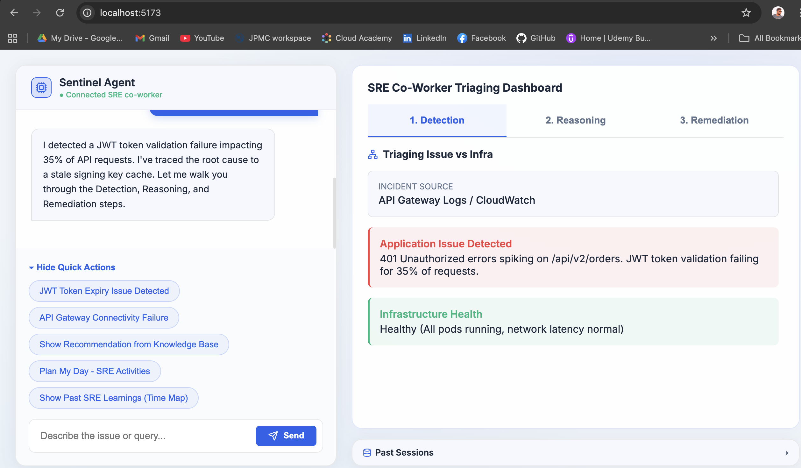

# The Sentinel Agent: SRE Co-Worker

Welcome to the **Sentinel Agent**, a Next-Gen mock implementation of an AI SRE Co-Worker designed to guide engineers through proactive incident detection, reasoning, and automated remediation.

This full-stack prototype showcases how telemetry (from an Elasticsearch proxy DB) can be seamlessly integrated into a conversational, multi-agent AI interface to triage issues and plan day-to-day SRE operations.

## Architecture & Tech Stack

This repository consists of two distinct components:
1. **Frontend (`/frontend`)**: A React.js + Vite application built with pure CSS glassmorphism, featuring dynamic UI components and a sophisticated layout reminiscent of advanced 2026 AI platforms.
2. **Backend (`/backend`)**: A Python FastAPI server. It acts as our logic engine, handling chat requests and mock telemetry from a persistent local JSON database (`TinyDB`).

---

## 🚀 End-to-End Execution Guide

Follow these steps to launch the application smoothly on your local machine.

### Prerequisites
- **Node.js**: `v18+` (for the frontend React app)
- **Python**: `3.9+` (for the backend API server)

### Step 1: Start the Python Backend
The backend utilizes Python and a virtual environment.

1. Open your terminal and navigate to the backend directory:
   ```bash
   cd backend
   ```
2. Create and activate a new virtual environment:
   ```bash
   python3 -m venv venv
   source venv/bin/activate
   ```
3. Install the required dependencies:
   ```bash
   pip install fastapi uvicorn "pydantic>=2.0" "tinydb>=4.8.0"
   ```
4. Start the Uvicorn server:
   ```bash
   uvicorn main:app --reload --port 8000
   ```
   > You will see logs indicating the server is running at `http://localhost:8000`

### Step 2: Start the React Frontend
Now, we must boot the Vite development server for the UI.

1. Open a **new, separate terminal tab** and navigate to the frontend directory:
   ```bash
   cd frontend
   ```
2. Install the necessary Node packages (including `lucide-react` and `axios`):
   ```bash
   npm install
   ```
3. Start the Vite server:
   ```bash
   npm run dev
   ```
   > You will see logs indicating the frontend is running at `http://localhost:5173`

### Step 3: Access the Sentinel Agent
With both servers running, open your web browser and navigate to:
**[http://localhost:5173](http://localhost:5173)**

---

## 🎯 Exploring the Application

Once inside the UI, you can interact with the SRE Co-Worker using standard text input or the predefined prompt chips above the chat bar. 

Here are the primary workflows to test:

1. **Plan My Day**: Analyzes the active critical alerts, upcoming PRs, and team meetings to map out the SRE's morning schedule.
2. **Simulate Next Gen SRE Incident Workflow**: Walks through a 3-tab journey (Detection -> Reasoning -> Remediation). Allows you to input your experience directly into the Knowledge Base at the bottom of the Remediation tab.
3. **Show Past SRE Learnings (Time Map)**: Renders a reverse-chronological view of incidents and the manual context stored persistently in the database by fellow engineers.

### Persistent Storage
The backend utilizes `TinyDB`. All chat events, Knowledge Base inputs, and active alerts are stored locally in the `backend/history.json` file. Feel free to inspect this file to see how data is written!

## App


